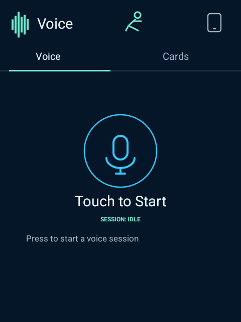
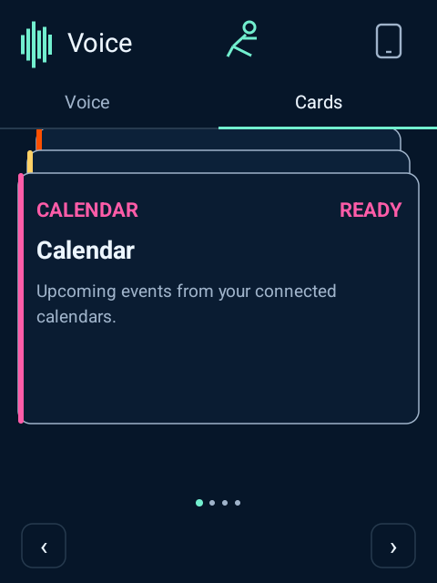
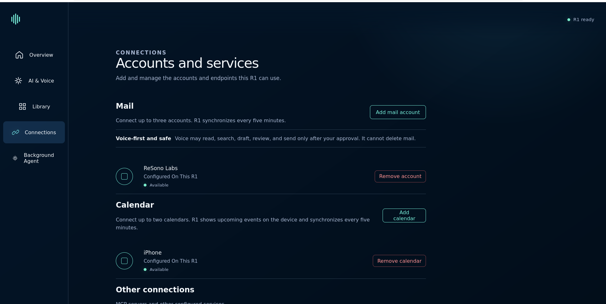
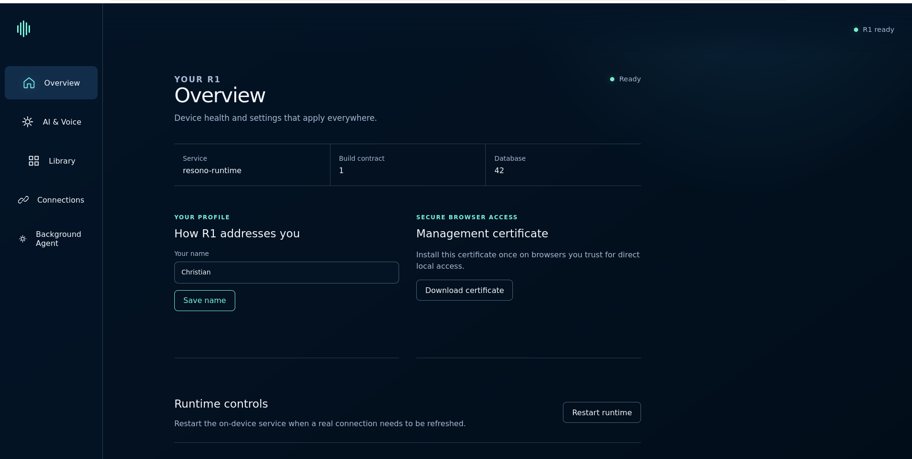
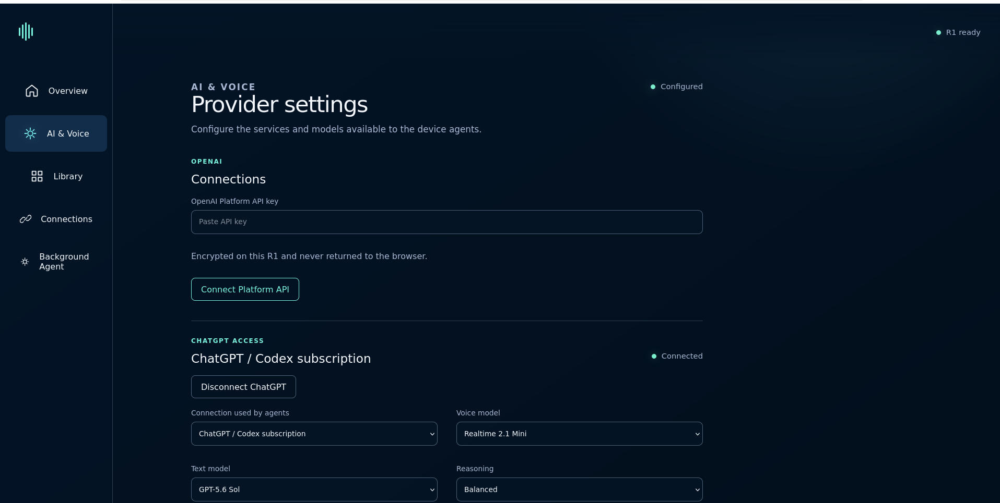
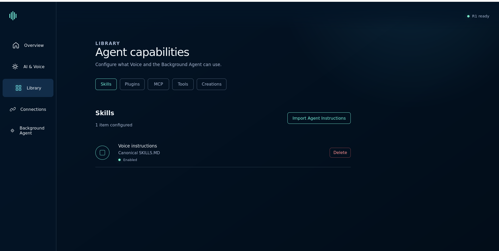
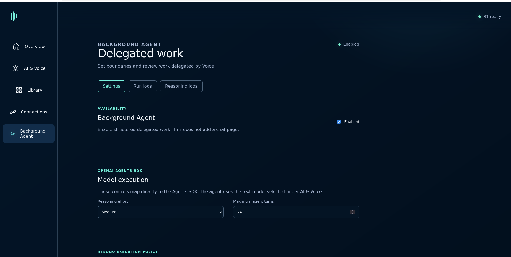

# JackRabbit

**A standalone, non-commercial community voice system for the Rabbit R1.**

> **Installing from the stock Rabbit R1 image?** Read the complete
> [stock-R1 installation instructions](installer/INSTALL.md) before starting.
> Do not begin the installation until you have reviewed the document fully.

JackRabbit turns the Rabbit R1 into a Voice-first device with native OpenAI Realtime conversations, an on-device agent runtime, local data, Cards, and a same-LAN management console. It keeps live microphone and speaker traffic in the native Android WebRTC path while the local runtime owns agents, tools, configuration, storage, and extensions.

Here, standalone means that the product runtime, storage, management site, and UI live directly on the R1. Network-backed AI and connected services still require their respective providers.

JackRabbit is under active development and runs on physical R1 hardware.

Join the [JackRabbit community on Discord](https://discord.gg/HeKGmh5mC) for
discussion, installation help, and contribution coordination.

<p align="center">
  
  &nbsp;
  
  &nbsp;
  
</p>

<p align="center"><em>Voice, Cards, and a real Calendar event on the 480×640 R1 display.</em></p>

## What JackRabbit does

| Area | Current behavior |
|---|---|
| Voice | Native WebRTC audio with `idle`, `connecting`, `live`, `responding`, and `error` states plus local MCP tools |
| AI access | One platform-wide connection using either ChatGPT/Codex device authorization or an owner-supplied OpenAI Platform API key |
| Cards | Built-in Calendar and Tasks Cards plus enabled static Creations |
| Personal data | Local Mail, Calendar, and Tasks domains exposed to Voice through bounded tools |
| Background Agent | OpenAI Agents SDK runs with tools, workspace files, cancellation, progress, safe reasoning summaries, and artifact delivery |
| Extensions | Agent Skills, Agent Plugins, MCP connections, tool permissions, and static Creations |
| Management | Paired same-LAN HTTPS console for runtime, AI, connections, extensions, and Background Agent |
| Device controls | Wi-Fi, Bluetooth, volume, brightness, keep-screen-awake behavior, runtime status, and restart |

The native camera preview, outward-facing open position, return-to-privacy behavior, Creation QR capture, and direct image handoff into a live Voice session are implemented on the R1.

## Voice on the R1

Voice is page one and Cards is page two. The native application is the device HOME surface and is designed specifically for the R1's 480×640 display, touch screen, scroll wheel, side button, audio path, and power behavior.

The current native Voice path provides:

- OpenAI Realtime audio over WebRTC, without routing high-rate audio through Python or MCP.
- Runtime-selected access, text model, Realtime model, reasoning effort, and personalized greeting.
- Local MCP tools in the same live Voice session.
- Native screen-awake behavior while JackRabbit is visible.
- Real session states instead of simulated activity.

The subscription catalog currently includes GPT-5.6 Sol, Terra, and Luna for text, and GPT-Realtime 2.1, GPT-Realtime 2.1 Mini, and GPT-Live 1 for Voice. OpenAI Platform choices are filtered from models returned by the account's `/models` response.

## Cards and local data

<p align="center">
  
  &nbsp;
  
</p>

The Cards deck always includes Calendar and Tasks, followed by enabled Creations.

- **Calendar:** Up to two ICS-file, ICS-subscription, or CalDAV sources. The runtime synchronizes on a five-minute cadence and projects upcoming events to the native Card. Provider capabilities control whether create, update, and delete operations are allowed.
- **Tasks:** Local title-and-completion records available to Voice and the native Tasks Card. Tasks do not currently have due dates, schedules, reminders, or notifications.
- **Mail:** Up to three IMAP/SMTP accounts with five-minute synchronization. Reading, read/unread changes, draft creation, and sending are supported. Sending requires an exact, single-use confirmation bound to the draft and user utterance. JackRabbit exposes no Mail delete, trash, expunge, or purge tool.

The management console owns account configuration and status. It does not expose Mail message content.

## Management console

The R1 serves its management console over HTTPS to a browser on the same local network. Pairing uses a six-digit, one-time code that expires after five minutes. A paired browser session lasts 30 minutes. State-changing requests are protected by the paired session, matching HTTPS origin, and CSRF token.

<p align="center">
  
  &nbsp;
  
</p>

From the browser, the owner can:

- Check device and runtime status, edit the Voice profile, download the local TLS certificate, and restart the runtime.
- Connect or disconnect ChatGPT/Codex authorization, save a Platform API key, and choose access, models, and reasoning effort.
- Configure Mail and Calendar connections without exposing their content in the management API.
- Import and manage Skills, Plugins, MCP connections, and Creations.
- Configure the Background Agent and inspect run status and safe operational logs.

See [Using JackRabbit](USER-GUIDE.md) for the operating guide.

## Skills, Plugins, MCP, Tools, and Creations

<p align="center">
  
</p>

JackRabbit keeps these extension boundaries distinct:

- **Skills** are standard `SKILL.md` instruction packages for Voice or Background Agent.
- **Plugins** use an Agent Plugins `plugin.json` manifest and may contain Skills and MCP declarations. Imports are preflighted before confirmation and support enable, disable, replacement, removal, quarantine, and interrupted-operation recovery.
- **MCP** is the model-facing tool boundary. JackRabbit has a local MCP server and manages outbound MCP connections, discovered tools, audiences, and permission intersections.
- **Tools** are visible according to their declared Voice, Background Agent, or shared audience.
- **Creations** are bounded static ZIP packages with an `index.html`. Enabled Creations appear as Cards in a confined native WebView. QR descriptors may identify Creation sources, and linked sources must use public HTTPS URLs.

Imports enforce archive size, path, link, encryption, and compression constraints. JackRabbit does not claim an extension marketplace or a general arbitrary-code trust model.

### Known issue: an installed Creation does not open

The current CipherOS-derived image can retain `com.android.webview` while
Android selects no active WebView provider. Creation installation still
succeeds, but opening the installed Card fails. This is an image/provider-state
issue, not a failed Creation import.

The verified recovery for an already-installed R1 is documented under
[Troubleshooting in Using JackRabbit](USER-GUIDE.md#an-installed-creation-does-not-open).
It does not require reflashing or reinstalling the Creation.

## Background Agent

<p align="center">
  
</p>

Voice can delegate a bounded goal to one on-device Background Agent worker. The worker uses the OpenAI Agents SDK rather than a second custom agent loop. Runs move through explicit states including queued, running, reviewing, repairing, completed, failed, and cancelled.

The default run limits are 300 seconds, 24 model turns, 40 tool calls, two review rounds, and an 8 MiB workspace. The queue holds up to eight runs and permits one active run for an origin. Workspace paths are confined, symbolic links are rejected, writes are atomic, and publishable artifacts move to durable storage.

Run Logs report lifecycle and delivery events. Reasoning Logs contain provider-returned reasoning summaries and bounded operational metadata such as tool name, order, duration, and error state. They do not expose private chain-of-thought, tool arguments, or tool results.

This execution path has completed real multi-turn research goals on the R1, published Markdown artifacts into durable workspace storage, displayed live progress and safe reasoning summaries, and delivered the latest run through the native runner view.

## Architecture

```text
Rabbit R1 hardware and retained Cipher device services
                         │
               JackRabbit Android HOME app
             ┌───────────┼────────────┐
             │           │            │
        Native UI   Native WebRTC   Device controls
             │           │
             │     OpenAI Realtime
             │
       Embedded Python runtime
     ┌───────┼─────────┬──────────────┐
     │       │         │              │
 Agents SDK  MCP   Domain services   HTTPS management
     │       │    Mail/Calendar/Tasks      │
     └───────┴─────────┬───────────────────┘
                       │
            SQLite + device-sealed secrets
```

The Android project keeps device UI, design/input/power primitives, individual features, runtime hosting, and motor integration in separate modules. The Python runtime owns versioned storage migrations, OpenAI providers, the Agents SDK path, tools, data domains, extensions, and management routes. Dependencies flow toward small public contracts rather than shared catch-all modules.

## Security and privacy boundaries

- Platform, subscription, and connection secrets cross a narrow Android bridge and are sealed with Android Keystore-backed AES-256-GCM. Plaintext credentials are not stored in the Python database.
- The local API token and management TLS key are device-protected. The certificate identity is bound to the active local Wi-Fi or Ethernet address when available.
- Management is limited to paired same-LAN HTTPS sessions and enforces origin and CSRF checks on mutations.
- Mail sending requires explicit confirmation, and Mail deletion is not exposed to the agent.
- Imported archives are inspected before activation; MCP tool access is reduced by both declared permission and agent audience.
- OpenAI requests, Mail and Calendar synchronization, web search, and configured outbound MCP servers necessarily send relevant data to those external services.
- Transcripts, summaries, memories, domain records, run records, and workspace data are stored locally in SQLite or device-owned storage according to their subsystem.

No formal security audit is claimed.

## Use JackRabbit

Starting from an already-running JackRabbit R1:

1. Open **Settings → Wi-Fi** and connect the R1 to the same network as your browser.
2. Open **Settings → Management** and note the displayed HTTPS address and pairing code.
3. Open that address in the browser, trust the certificate shown by the R1, and enter the pairing code.
4. **Do not skip this:** on **Overview**, find **Your Profile**, enter your name
   in **Your name**, and choose **Save name**. Confirm that the page reports
   **Name saved.** JackRabbit uses this for your personalized Voice greeting.
5. In **AI & Voice**, connect either ChatGPT/Codex or an OpenAI Platform API key. OAuth must be disconnected before Platform access can be activated; completing OAuth makes it the active platform-wide connection.
6. Choose an available text model, Realtime model, and reasoning effort for the active connection.
7. Return to Voice and press the microphone control to start a session.
8. Optionally add Mail or Calendar connections and enable extensions from the management console.

For device controls, Cards, data connections, extensions, Background Agent, and troubleshooting, read [Using JackRabbit](USER-GUIDE.md).

## Repository map

- `android/` — native HOME application, R1 features, runtime host, and device integration.
- `runtime/` — supervised on-device Python runtime, providers, agents, tools, storage, data domains, and extensions.
- `web/` — responsive same-LAN management interface.
- `images/` — screenshots used by this README and the operating guide.
- `BUILDING.md`, `USER-GUIDE.md`, and `llm.md` — build, operating, and coding-assistant guidance.

The current schema is migration version 42. The Android application targets API 36, requires API 31 or newer, is built for ARM64, and embeds Python 3.13 with `openai-agents` 0.18.3.

## Project principles

- Ship connected behavior, not mockups or simulated product states.
- Keep one owner for each responsibility and preserve one-way module dependencies.
- Use the OpenAI Agents SDK for applicable agents and MCP for model-facing tools.
- Follow Agent Skills and Agent Plugins formats within their actual scope.
- Keep subscription device authorization separate from credentials for external MCP services.
- Keep hardware and live-provider claims grounded in reproducible behavior.

## Contributing

Focused contributions should preserve the ownership boundaries above and keep the APK modular. Read [BUILDING.md](BUILDING.md) before changing the application and [llm.md](llm.md) when using a coding assistant.

Questions and contribution discussions are welcome in the
[JackRabbit Discord community](https://discord.gg/HeKGmh5mC).

## License

JackRabbit is source-available under the
[PolyForm Noncommercial License 1.0.0](LICENSE). Community members may use,
study, modify, fork, and share JackRabbit and modified versions for
noncommercial purposes, subject to the license and its required notices.

Commercial use is not permitted. This includes selling JackRabbit, including it
in a paid product or service, monetizing its distribution, or using it for an
anticipated commercial application. JackRabbit is and will remain a
noncommercial community project: ReSono Labs will not sell JackRabbit, offer a
commercial license for it, or authorize commercial use or monetized
distribution.

This is a source-available noncommercial license, not an OSI-approved license.
Third-party components remain subject to their own licenses. JackRabbit is an
independent community project and is not affiliated with, endorsed by, or
sponsored by rabbit inc.
