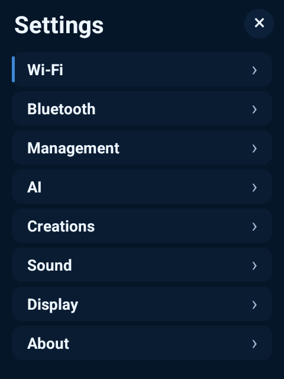

# JackRabbit

**A standalone, non-commercial community voice system for the Rabbit R1.**

JackRabbit turns the Rabbit R1 into a Voice-first device with native OpenAI Realtime conversations, an on-device agent runtime, local data, Cards, and a same-LAN management console. It keeps live microphone and speaker traffic in the native Android WebRTC path while the local runtime owns agents, tools, configuration, storage, and extensions.

Here, standalone means that the product runtime, storage, management site, and UI live on the R1 rather than depending on the external ReSono Vault. Network-backed AI and connected services still require their respective providers.

JackRabbit is under active development. It runs on physical R1 hardware, but it is not yet a finished public release. The capability table below separates what has been proved on a device from what currently has source-and-test evidence only.

<p align="center">
  
  &nbsp;
  
  &nbsp;
  
</p>

<p align="center"><em>Voice, Cards, and a real Calendar event on the 480×640 R1 display.</em></p>

## What JackRabbit does

| Area | Current behavior | Evidence boundary |
|---|---|---|
| Voice | Native WebRTC audio with truthful `idle`, `connecting`, `live`, `responding`, and `error` states | Realtime 2.1 Mini sessions and native MCP use have been proved on an R1 |
| AI access | ChatGPT/Codex device authorization or an owner-supplied OpenAI Platform API key; selectable text, Realtime, and reasoning settings | Subscription authorization, GPT-5.6 Sol text, and reasoning selection have physical evidence; Platform models are reported by the provider |
| Cards | Built-in Calendar and Tasks Cards plus enabled static Creations | Cards navigation and a live Calendar projection have physical evidence |
| Personal data | Local Mail, Calendar, and Tasks domains exposed to Voice through bounded tools | Implemented and tested; provider-specific physical acceptance remains narrower |
| Background Agent | Bounded OpenAI Agents SDK runs with tools, workspace files, cancellation, logs, and artifact delivery | Implemented and focused tests pass; a successful post-correction physical delegated run is not yet recorded |
| Extensions | Agent Skills, Agent Plugins, MCP connections, tool permissions, and static Creations | Real lifecycle implementations exist; some extension paths remain partially accepted |
| Management | Paired same-LAN HTTPS console for runtime, AI, connections, extensions, and Background Agent | Same-LAN access, settings delivery, and runtime restart have physical evidence |
| Device controls | Wi-Fi, Bluetooth, volume, brightness, keep-screen-awake behavior, runtime status, and restart | Current Settings and display/runtime behavior have physical evidence |

Camera remains a known deferred defect and is not claimed as a working capability.

## Voice on the R1

Voice is page one and Cards is page two. The native application is the device HOME surface and is designed specifically for the R1's 480×640 display, touch screen, scroll wheel, side button, audio path, and power behavior.

The current native Voice path provides:

- OpenAI Realtime audio over WebRTC, without routing high-rate audio through Python or MCP.
- Runtime-selected access, text model, Realtime model, reasoning effort, and personalized greeting.
- Local MCP tools in the same live Voice session.
- Native screen-awake behavior while JackRabbit is visible.
- Real session states instead of simulated activity.

The subscription catalog currently includes GPT-5.6 Sol, Terra, and Luna for text, and GPT-Realtime 2.1, GPT-Realtime 2.1 Mini, and GPT-Live 1 for Voice. A catalog entry means the runtime can offer the model; it does not mean every model has completed physical acceptance. OpenAI Platform choices are filtered from models returned by the account's `/models` response.

## Cards and local data

<p align="center">
  
  &nbsp;
  
</p>

The Cards deck always includes Calendar and Tasks, followed by enabled Creations.

- **Calendar:** Up to two ICS-file, ICS-subscription, or CalDAV sources. The runtime synchronizes on a five-minute cadence and projects upcoming events to the native Card. Provider capabilities control whether create, update, and delete operations are allowed.
- **Tasks:** Local title-and-completion records available to Voice and the native Tasks Card. Tasks do not currently have due dates, schedules, reminders, or notifications.
- **Mail:** Up to three IMAP/SMTP accounts with five-minute synchronization. Reading, read/unread changes, draft creation, and sending are supported. Sending requires an exact, single-use confirmation bound to the draft and user utterance. JackRabbit exposes no Mail delete, trash, expunge, or purge tool.

The management console owns account configuration and status. It does not expose Mail message content.

## Management console

The R1 serves its management console over HTTPS to a browser on the same local network. Pairing uses a six-digit, one-time code that expires after five minutes. A paired browser session lasts 30 minutes. State-changing requests are protected by the paired session, matching HTTPS origin, and CSRF token.

<p align="center">
  
  &nbsp;
  
</p>

From the browser, the owner can:

- Check device and runtime status, edit the Voice profile, download the local TLS certificate, and restart the runtime.
- Connect or disconnect ChatGPT/Codex authorization, save a Platform API key, and choose access, models, and reasoning effort.
- Configure Mail and Calendar connections without exposing their content in the management API.
- Import and manage Skills, Plugins, MCP connections, and Creations.
- Configure the Background Agent and inspect run status and safe operational logs.

See [Using JackRabbit](github_documents/USER-GUIDE.md) for the operating guide.

## Skills, Plugins, MCP, Tools, and Creations

<p align="center">
  
</p>

JackRabbit keeps these extension boundaries distinct:

- **Skills** are standard `SKILL.md` instruction packages for Voice or Background Agent.
- **Plugins** use an Agent Plugins `plugin.json` manifest and may contain Skills and MCP declarations. Imports are preflighted before confirmation and support enable, disable, replacement, removal, quarantine, and interrupted-operation recovery.
- **MCP** is the model-facing tool boundary. JackRabbit has a local MCP server and manages outbound MCP connections, discovered tools, audiences, and permission intersections.
- **Tools** are visible according to their declared Voice, Background Agent, or shared audience.
- **Creations** are bounded static ZIP packages with an `index.html`. Enabled Creations appear as Cards in a confined native WebView. QR descriptors may identify Creation sources, and linked sources must use public HTTPS URLs.

Imports enforce archive size, path, link, encryption, and compression constraints. JackRabbit does not claim an extension marketplace or a general arbitrary-code trust model.

One current test identifies a Plugin lifecycle defect: replacing a Plugin that supplied a Card with a package that supplies no Card can leave the previous Card registered but disabled. This remains a known limitation.

## Background Agent

<p align="center">
  
</p>

Voice can delegate a bounded goal to one on-device Background Agent worker. The worker uses the OpenAI Agents SDK rather than a second custom agent loop. Runs move through explicit states including queued, running, reviewing, repairing, completed, failed, and cancelled.

The default run limits are 300 seconds, 24 model turns, 40 tool calls, two review rounds, and an 8 MiB workspace. The queue holds up to eight runs and permits one active run for an origin. Workspace paths are confined, symbolic links are rejected, writes are atomic, and publishable artifacts move to durable storage.

Run Logs report lifecycle and delivery events. Reasoning Logs contain provider-returned reasoning summaries and bounded operational metadata such as tool name, order, duration, and error state. They do not expose private chain-of-thought, tool arguments, or tool results.

This execution path has focused automated coverage, but the latest corrections do not yet have a recorded successful end-to-end physical delegated run. The interface is therefore shown as implemented development functionality, not as fully accepted hardware behavior.

## Architecture

```text
Rabbit R1 hardware and retained Cipher device services
                         │
               JackRabbit Android HOME app
             ┌───────────┼────────────┐
             │           │            │
        Native UI   Native WebRTC   Device controls
             │           │
             │     OpenAI Realtime
             │
       Embedded Python runtime
     ┌───────┼─────────┬──────────────┐
     │       │         │              │
 Agents SDK  MCP   Domain services   HTTPS management
     │       │    Mail/Calendar/Tasks      │
     └───────┴─────────┬───────────────────┘
                       │
            SQLite + device-sealed secrets
```

The Android project keeps device UI, design/input/power primitives, individual features, runtime hosting, and motor integration in separate modules. The Python runtime owns versioned storage migrations, OpenAI providers, the Agents SDK path, tools, data domains, extensions, and management routes. Dependencies flow toward small public contracts rather than shared catch-all modules.

## Security and privacy boundaries

- Platform, subscription, and connection secrets cross a narrow Android bridge and are sealed with Android Keystore-backed AES-256-GCM. Plaintext credentials are not stored in the Python database.
- The local API token and management TLS key are device-protected. The certificate identity is bound to the active local Wi-Fi or Ethernet address when available.
- Management is limited to paired same-LAN HTTPS sessions and enforces origin and CSRF checks on mutations.
- Mail sending requires explicit confirmation, and Mail deletion is not exposed to the agent.
- Imported archives are inspected before activation; MCP tool access is reduced by both declared permission and agent audience.
- OpenAI requests, Mail and Calendar synchronization, web search, and configured outbound MCP servers necessarily send relevant data to those external services.
- Transcripts, summaries, memories, domain records, run records, and workspace data are stored locally in SQLite or device-owned storage according to their subsystem.

No formal security audit is claimed.

## Use JackRabbit

Starting from an already-running JackRabbit R1:

1. Open **Settings → Wi-Fi** and connect the R1 to the same network as your browser.
2. Open **Settings → Management** and note the displayed HTTPS address and pairing code.
3. Open that address in the browser, trust the certificate shown by the R1, and enter the pairing code.
4. In **AI & Voice**, connect ChatGPT/Codex or save an OpenAI Platform API key.
5. Choose an available access path, text model, Realtime model, and reasoning effort.
6. Return to Voice and press the microphone control to start a session.
7. Optionally add Mail or Calendar connections and enable extensions from the management console.

For device controls, Cards, data connections, extensions, Background Agent, and troubleshooting, read [Using JackRabbit](github_documents/USER-GUIDE.md).

## Current limitations

- The project targets the Rabbit R1; other Android hardware and OS variants are not supported by current evidence.
- Camera is deferred and remains a final hardware acceptance requirement.
- A model appearing in the catalog is not proof that it has passed on-device validation.
- Some Mail, Calendar, Plugin, MCP, Creation, and Background Agent paths have source-and-test evidence but incomplete provider or physical acceptance.
- The Plugin Card replacement defect described above remains open.
- Browser certificate trust steps vary by browser and operating system.
- The repository does not yet contain final project license text or consolidated third-party notices.

## Repository map

- `android/` — native HOME application, R1 features, runtime host, and device integration.
- `runtime/` — supervised on-device Python runtime, providers, agents, tools, storage, data domains, and extensions.
- `web/` — responsive same-LAN management interface.
- `tests/` — host-side runtime and contract tests.
- `docs/` — accepted delivery records, technical references, and project documentation.
- `github_documents/` — public project images and operating guide.

The current schema is migration version 42. The Android application targets API 36, requires API 31 or newer, is built for ARM64, and embeds Python 3.13 with `openai-agents` 0.18.3.

## Verification status

Recent targeted evidence runs from the current tree produced:

- Background Agent: **22 passed**.
- Mail, Calendar, Tasks, Skills, Plugins, MCP, Creations, and tool catalog: **26 passed, 1 known Plugin lifecycle failure**.
- Provider, runtime lifecycle, Agents SDK, MCP server, Realtime session, and management pairing: **16 passed, 1 stale Build 07 API-auth test failure** caused by an obsolete `SkillRoutes` constructor call.

These results describe selected suites, not every test in the repository. Hardware claims in this README come from recorded physical R1 evidence, not host tests alone.

## Project principles

- Ship connected behavior, not mockups or simulated product states.
- Keep one owner for each responsibility and preserve one-way module dependencies.
- Use the OpenAI Agents SDK for applicable agents and MCP for model-facing tools.
- Follow Agent Skills and Agent Plugins formats within their actual scope.
- Keep subscription device authorization separate from credentials for external MCP services.
- Require physical evidence for claims about R1 hardware and live provider behavior.

## Contributing

JackRabbit is being prepared as a clean community codebase. Focused issues and pull requests should preserve the architecture boundaries above, include mirrored tests, and distinguish host evidence from physical R1 evidence. The public issue and pull-request workflow is still an owner decision.

## License status

The project is currently described as free to use, modify, and share for non-commercial purposes; commercial use requires prior written permission from ReSono Labs. Formal project license text and consolidated third-party notices are not yet present, so this repository must not yet be described as open source or ready for public distribution.
