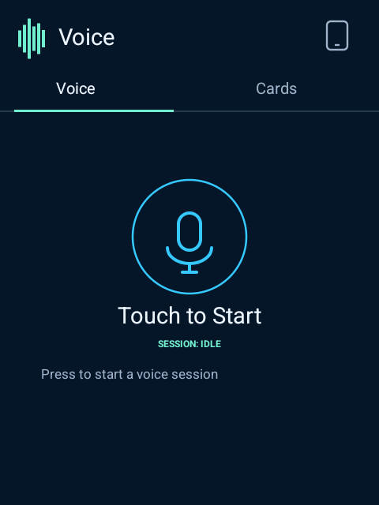
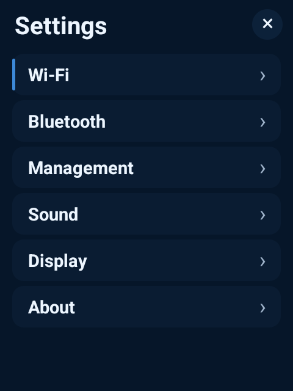
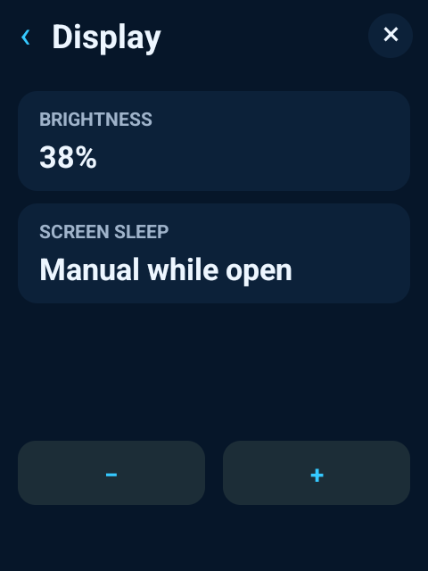
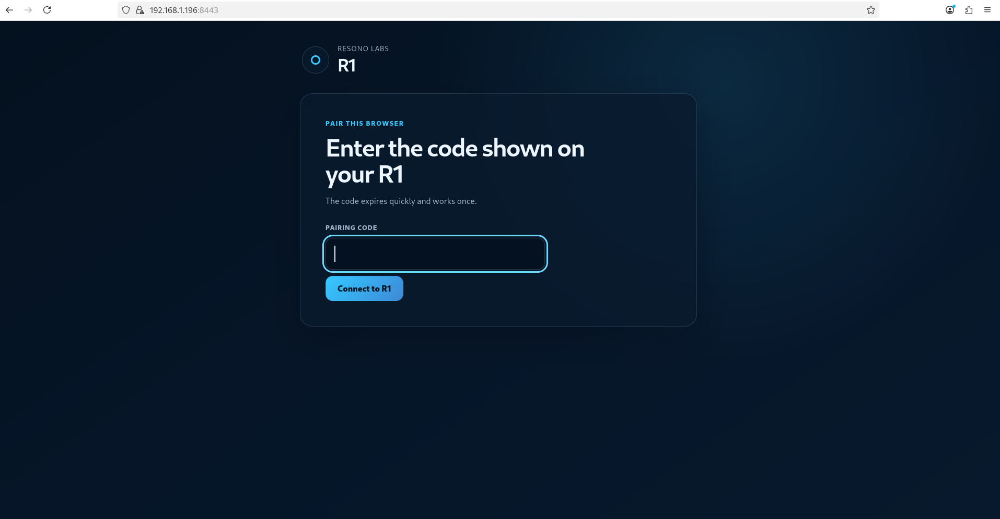
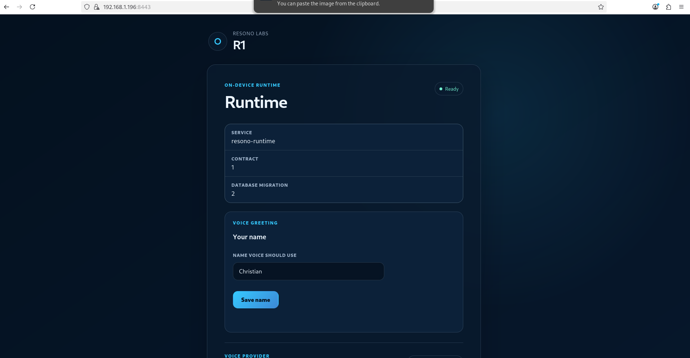
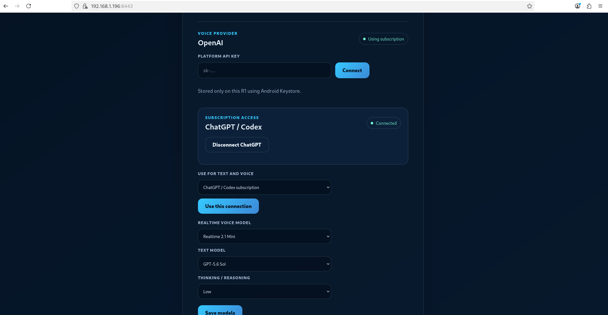

# JackRabbit

**A standalone, non-commercial community voice system for the Rabbit R1.**

JackRabbit turns the R1 into a self-contained ReSono voice device. It combines a native HOME application, OpenAI Realtime voice, an on-device runtime, local storage, and a browser-based management interface while preserving the working Rabbit/Cipher hardware foundation.

The goal is simple: boot into Voice, speak naturally, see truthful live session states, and make the device easy for its owner and the community to configure, extend, and improve—without depending on the external ReSono Vault.

JackRabbit is under active development. It already runs on physical R1 hardware, but it is not yet a finished community release.

## Current physical R1 build

<p align="center">
  
  &nbsp;
  
  &nbsp;
  
</p>

<p align="center"><em>Voice, Settings, and Display controls captured from the physically installed JackRabbit build.</em></p>

## Current management interface

JackRabbit serves its management website directly from the R1. A browser on the same network pairs using a short-lived, one-time code shown on the device. The current working interface covers pairing, runtime status, the personalized Voice greeting, OpenAI Platform and ChatGPT/Codex subscription access, connection selection, text and Realtime models, and reasoning level.

The management interface will become more comprehensive as sessions, memory, skills, plugins, personal-data services, Hermes, and External AI land. These screenshots show the real interface running today.

### Pair the browser



### Runtime and Voice profile



### Provider and model selection



## Where the project is today

The first three foundation stages are complete and physically tested:

- The native R1 application and device baseline have been reproduced and physically verified.
- A reversible engineering system image boots directly into ReSono while retaining the working R1 hardware stack.
- A supervised Python runtime runs on the device with SQLite storage, recovery, and an authenticated local HTTPS management site.
- The standalone Android product is a native HOME app with working touch, scroll wheel, side-button, power, audio, and WebRTC foundations.
- ChatGPT/Codex subscription authorization works through OpenAI device-code OAuth, with encrypted credentials stored by the trusted device runtime.
- GPT-5.6 Sol text execution has run through the OpenAI Agents SDK on the physical R1.
- The local MCP device-status tool has been exercised by the text agent.
- Realtime 2.1 Mini has completed a live native WebRTC session using ChatGPT subscription access.
- Native Voice has invoked the local MCP device-status tool and returned its real result through the same Realtime session.
- Text and Realtime model selection, reasoning selection, and the owner's personalized Voice greeting are stored and managed through the real web interface.
- The R1 Voice page uses the shared ReSono visual language and reports real `idle`, `connecting`, `live`, `listening`, `responding`, and failure states.
- Display brightness controls, keep-screen-awake behavior, foreground runtime recovery, and same-LAN management access work on the current device candidate.

The accepted physical working base is version 26. Version 28 is the current installed candidate and adds the tuned audio/VAD configuration and display controls. Its display/runtime behavior and a complete live VAD plus native MCP session are physically verified.

The current APK is available as a prerelease: [JackRabbit v0.4.18 device candidate](https://github.com/ReSono-Labs/JackRabbit/releases/tag/v0.4.18-device-candidate).

> This build is intended for development R1 devices. It is not yet the final installer or consumer-ready system image.

## What remains to be built

Work is intentionally proceeding one real vertical slice at a time. Mockups, simulated integrations, and disconnected controls do not count as progress.

### Finish the core Voice and text product

- Independently validate the OpenAI Platform API path for text and Realtime.
- Complete supported `gpt-live-1` transport validation.
- Resolve normal browser certificate trust for the local management site.
- Finish the compact R1 Voice interface and its connected session views.

### Add local sessions and memory

- Store transcripts, session events, summaries, and extracted memories locally.
- Use an OpenAI Agents SDK post-session agent to review sessions and write approved memory.
- Add bounded local semantic/vector retrieval alongside SQLite text search.
- Provide real memory inspection, deletion, and export controls.

### Add standard extensions and personal data

- Implement the [Agent Skills](https://agentskills.io/) loader using standard `SKILL.md` packages.
- Implement [Agent Plugins](https://agent-plugins.org/) with declared permissions and MCP support.
- Add Mail first to prove the shared local storage, connection, UI, and plugin boundary.
- Add Calendar, Contacts, and Reminders through that same boundary.
- Make installing, creating, validating, enabling, disabling, and removing extensions straightforward from the management interface.

### Connect external agents and AI clients

- Connect Hermes through standards-compliant A2A discovery, tasks, streaming, cancellation, and results.
- Keep OpenClaw support documented as a future standards-based A2A adapter rather than a proprietary JackRabbit integration.
- Build the provider-neutral External AI Outbox and public HTTPS MCP gateway.
- Add ChatGPT as the first external AI client while keeping the gateway self-hostable and its endpoint configurable.

### Produce the community system image

- Remove or replace the remaining visible Cipher UI, pull-down shade, launcher, Settings presentation, and unnecessary bundled applications.
- Preserve the working kernel, firmware, vendor services, HALs, and R1 hardware behavior.
- Finish installation, signing, updates, rollback, reset, recovery, licensing, and third-party notices.
- Run the complete physical-device acceptance suite and publish the first community release.

Camera support is a known deferred issue. Camera work is deliberately not blocking the current Voice product slice.

## Product architecture

```text
Rabbit/Cipher hardware substrate
        |
        +-- JackRabbit HOME APK
        |     +-- native R1 input and hardware integration
        |     +-- native WebRTC audio
        |     +-- native ReSono Voice interface
        |
        +-- On-device JackRabbit runtime
        |     +-- OpenAI providers and Agents SDK
        |     +-- MCP tools and permissions
        |     +-- SQLite, sessions, and memory
        |     +-- skills, plugins, and A2A
        |
        +-- Local management website
        |     +-- pairing and credentials
        |     +-- model and profile settings
        |     +-- agents, skills, plugins, and connections
        |
        +-- Stripped JackRabbit system image
```

Native WebRTC remains responsible for live microphone and speaker transport. The on-device runtime owns trusted credentials, configuration, agents, tools, storage, and extension boundaries. High-rate audio is not routed through Python or MCP.

## Repository structure

- `android/` — standalone native HOME application and embedded runtime host.
- `runtime/` — small supervised on-device Python runtime.
- `web/` — responsive local management interface and shared design tokens.
- `tests/` — runtime and component tests.
- `docs/images/` — screenshots used by this public project page.

Generated APKs and raw Android images are excluded from Git history. Device candidates are published through GitHub Releases with recorded SHA-256 hashes.

## Development principles

- Build a working product, never a mockup.
- Keep the codebase small, clean, logical, and easy to navigate.
- Use the OpenAI Agents SDK for applicable text and background agents.
- Use MCP for model-facing tools and context.
- Follow the Agent Skills, Agent Plugins, and A2A standards rather than creating ReSono-only formats.
- Keep trusted core code separate from the user-editable workspace.
- Require physical R1 evidence for hardware, APK, and system-image claims.

## Building

The Android build currently expects Java 17, the Android SDK, Gradle 9.5, and a host Python 3.13 interpreter at the paths used by the project build script. These paths will be made configurable and documented more fully before the community release.

```bash
android/scripts/build_debug.sh
```

The build runs Android unit tests, assembles the APK, checks module boundaries, and verifies the embedded runtime package. Public installation and system-image documentation will be added when those flows are ready for community use.

## Contributing

JackRabbit is being prepared as a clean community baseline. Contribution instructions and issue templates will be added before the first public development milestone. Until then, issues and focused pull requests against the working source are welcome.

## License

JackRabbit is free to use, modify, and share for non-commercial purposes. Commercial use requires prior written permission from ReSono Labs.

Third-party code, libraries, assets, and retained platform components remain subject to their respective licenses and notices.
